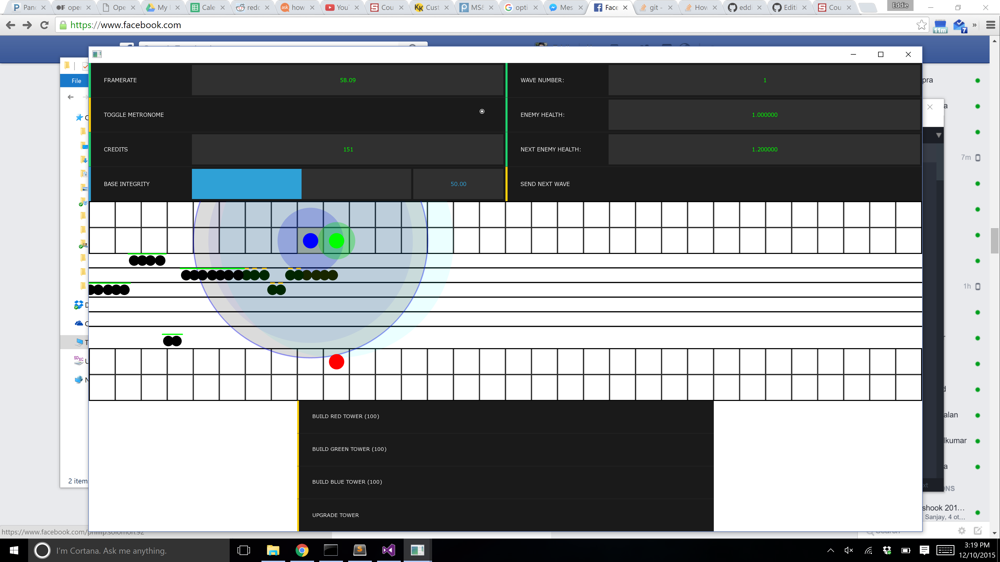
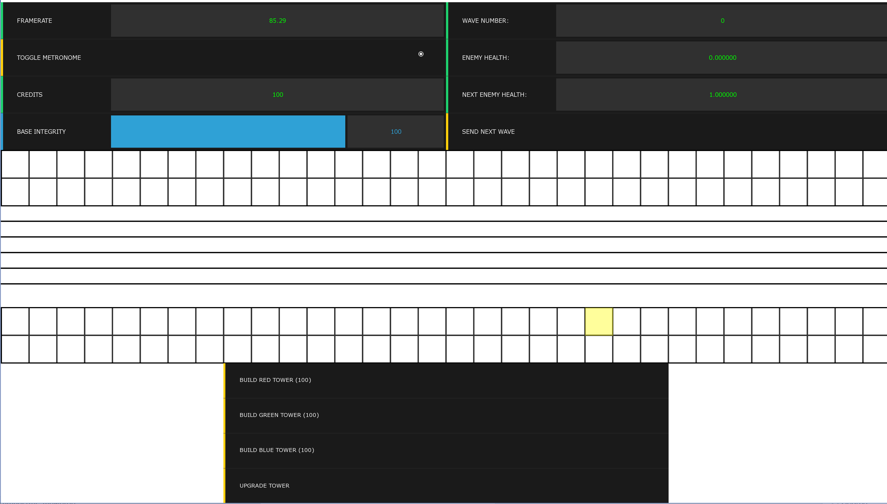
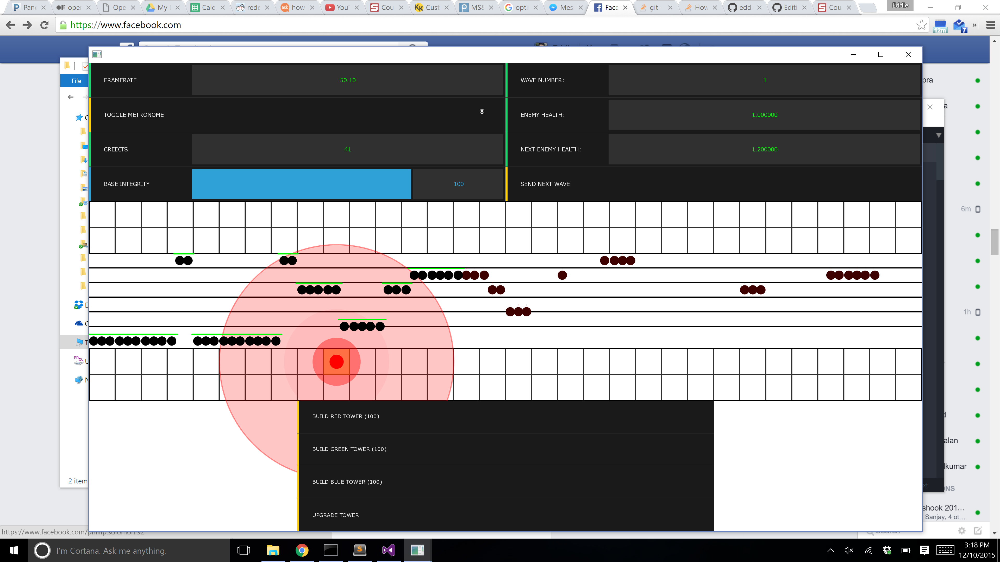

# beatTD
Build towers. Protect your base. Make sick beats.
beatTD is a tower defense game where YOU decide how your towers work.

## To Build (Windows)
1. Install [openFrameworks](http://www.openframeworks.cc/) and the ofxMidi and ofxCsv extensions.
2. `git clone` this repo on your machine or download it as a .zip
3. Point final-project to your openFrameworks installation in `final-project.vcxproj`
4. Build in Visual Studio

## To Run (Windows)
1. Install a midi server. I used [VirtualMIDISynth](http://coolsoft.altervista.org/en/virtualmidisynth). I also use the [arachno](http://www.arachnosoft.com/main/soundfont.php) soundfont.
2. Run `bin/final-project`

## Design
This project seeks to enable the player to create music while enjoying a game. It allows the user to define their own rhythm at which the towers shoot at the enemies, and there are incentives for creating a strong rhythm.

## More screenshots
Opening screen

One tower

Many towers

